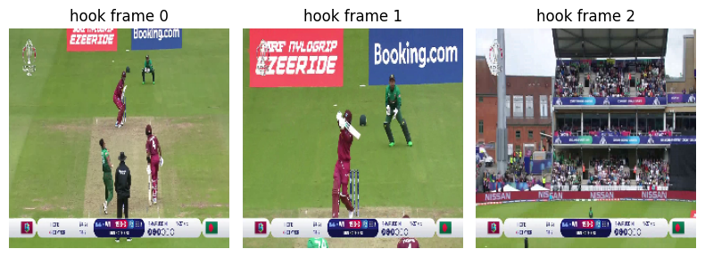

# Cricket Shot Classification using MobileNetV2 and LSTM

This repository contains the implementation of a deep learning model designed to classify cricket shots using MobileNetV2 and LSTM layers. The model utilizes both frame-level features and temporal dependencies to accurately classify different cricket shots.

## Table of Contents

- [Introduction](#introduction)
- [Model Architecture](#model-architecture)
- [Results](#results)
  - [Accuracy and Loss Graphs](#accuracy-and-loss-graphs)
  - [Confusion Matrix](#confusion-matrix)
  - [Frame Visualizations](#frame-visualizations)
- [Pros and Cons](#pros-and-cons)
- [Possible Future Work](#possible-future-work)
- [How to Use](#how-to-use)
- [Dependencies](#dependencies)
- [License](#license)

## Introduction

Cricket is a sport with a diverse set of shots that can be challenging to classify automatically. This project aims to build a robust classifier for different cricket shots using video data. The model is based on the MobileNetV2 architecture followed by LSTM layers to capture temporal dependencies.

## Model Architecture

The model architecture includes:
- **MobileNetV2**: For feature extraction from individual frames.
- **LSTM layers**: To capture temporal dependencies across frames.
- **Dense Layers**: To finalize the prediction based on combined features.

## Results

### Accuracy and Loss Graphs

The graphs below illustrate the training and validation accuracy and loss over the epochs:

- **Accuracy**
  
  

- **Loss**
  
  

### Confusion Matrix

The confusion matrix below shows the performance of the model across different cricket shots:

### Frame Visualizations

The images below represent different frames captured during the cricket shots, showcasing the model's input:

- **Cover Shot Frames**
  
  

- **Defense Shot Frames**
  
  

- **Flick Shot Frames**
  
  

- **Hook Shot Frames**
  
  

- **Lofted Shot Frames**
  
  

- **Pull Shot Frames**
  
  

## Pros and Cons

### Pros
- **Efficient Feature Extraction**: MobileNetV2 provides a lightweight yet powerful feature extractor.
- **Temporal Modeling**: LSTM layers help in capturing temporal patterns across frames, which is crucial for video classification tasks.
- **Scalability**: The architecture can be easily adapted to other sports or video-based tasks.

### Cons
- **Training Complexity**: The model requires significant computational resources for training, especially with large datasets.
- **Overfitting**: The model may be prone to overfitting, as indicated by the validation loss and accuracy divergence.

## Possible Future Work
- **Data Augmentation**: Implementing advanced data augmentation techniques to improve generalization.
- **Transfer Learning**: Using pre-trained weights from similar tasks to reduce training time and enhance performance.
- **Real-Time Classification**: Optimizing the model for real-time classification on low-powered devices.

## How to Use

1. **Clone the repository**:
   git clone https://github.com/your-username/Cricket-Shot-Classification-MobilenetV2-LSTM.git
